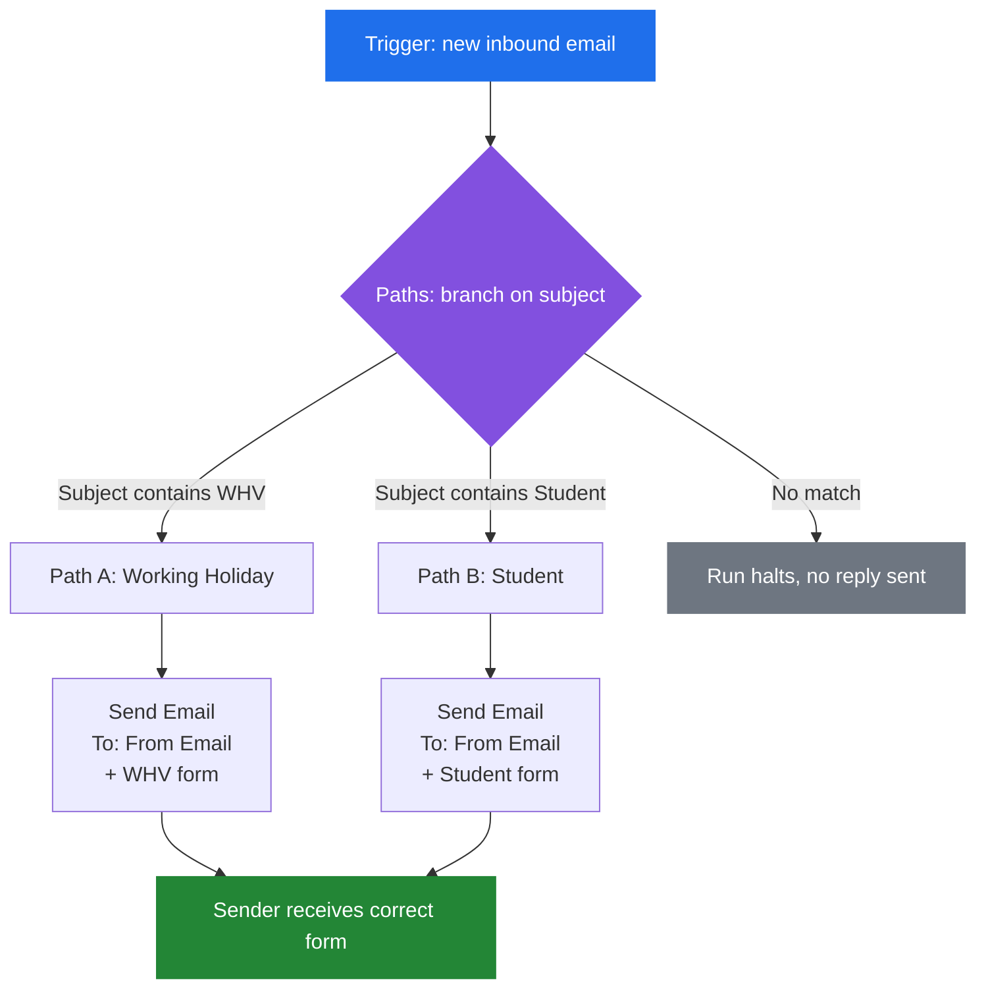

# Automated Visa Form Routing System

**Event-driven email automation that classifies inbound visa inquiries by type and auto-replies with the correct application form — no human touch, no code.**

Built with Zapier + Gmail. This write-up covers the architecture, the routing bug that took the longest to find, and why the final design scales to any number of senders without modification.

> Inbox addresses and any client-identifying details are redacted throughout. Placeholders are marked `[redacted]`.

---

## The Problem

A visa inquiry inbox received a steady stream of emails, each needing the same response: identify which visa stream the sender was asking about, then reply with the matching application form.

Two streams accounted for nearly all volume:

| Inquiry type | Signal | Response |
|---|---|---|
| Working Holiday Visa | `WHV` in subject line | WHV application form |
| Student Visa | `Student` in subject line | Student application form |

Manually, this is pure clerical repetition — read subject, pick attachment, hit reply. Response times depended entirely on whether someone happened to be at a desk. The goal was near-immediate replies, unattended, at any hour.

---

## Architecture



**Three moving parts:**

1. **Trigger** — fires on every new email arriving at the monitored inbox
2. **Paths** — a parallel branch point; each branch carries its own independent condition on the subject line
3. **Send Email** — per-branch reply, addressed dynamically, with the branch's form attached

---

## The Key Design Decision: Paths, Not Sequential Filters

The first working version used **sequential Filter steps** in a single linear chain:

```
Trigger -> Filter "contains WHV" -> Send WHV form -> Filter "contains Student" -> Send Student form
```

This looks reasonable and is completely broken. A Filter in a linear Zap doesn't route — it **halts the entire run** when its condition fails. So:

- An email with `WHV` in the subject → passes filter 1, sends the WHV form, then **dies at filter 2** (subject doesn't contain "Student"). Fine by accident.
- An email with `Student` in the subject → **dies at filter 1** and never reaches the Student branch at all.

One stream worked. The other silently did nothing — no error, no bounce, no log entry that read as a failure. The run just ended early and reported success.

**The fix** was replacing the linear chain with **Paths**, which are genuinely parallel:

| | Sequential Filters | Paths |
|---|---|---|
| Failed condition | Halts the whole run | Skips only that branch |
| Branches evaluated | First-match, then dead | All, independently |
| Adding a third visa type | Reorder and re-test everything | Add a branch, touch nothing else |

Each path owns its condition, and a non-matching path is a no-op rather than a kill switch.

---

## The Bug That Took Longest to Find

After the restructure, **both paths still failed**. Structure was right, conditions were right, and Zap History showed runs reaching the Send Email step and erroring there.

The cause was an **unmapped required field** on the Send Email action. It rendered as an empty input rather than a validation error, so the step looked configured. It wasn't — it was silently incomplete, and the action refused to execute.

**What made this hard:** the two failures had completely different root causes (routing semantics, then a blank field) but presented identically from the outside — "the email didn't send." Fixing the first bug changed nothing observable, which is exactly the situation where it's tempting to assume the fix was wrong and revert it.

**What actually resolved it** was refusing to guess and reading Zap History per-step, classifying each run into one of four states:

```
1. Never triggered               -> trigger / inbox config
2. Triggered, no branch matched   -> path condition
3. Branch matched, then stopped   -> filter logic
4. Reached Send Email, errored    -> action config   <-- it was here
```

That narrows a vague "it doesn't work" to one step in a single pass. Both bugs were found this way.

---

## Scaling to Any Sender

The `To` field is **never hardcoded**. It maps to the trigger's `From Email` value, so each run replies to whoever sent that specific email:

```
Send Email
  To:      {{From Email}}      <-- dynamic, resolved per run
  Subject: Your [visa type] application form
  Body:    <template>
  Attach:  [visa type] form
```

Consequences worth stating explicitly:

- **No allowlist to maintain.** Any sender, any address, first time or hundredth — no config change.
- **Concurrent senders are isolated.** Two people emailing about the same visa type trigger two independent runs. No shared state, no cross-contamination of recipients.
- **Unmatched subjects are silent by design.** No match means no reply, rather than a wrong form or an error message to a stranger.

**Known edge case:** Gmail's `From Email` field can, depending on how the raw header is parsed, arrive as `Name <address@example.com>` rather than a bare address. It parsed cleanly across all test runs here, but it's the field to check first if sends ever start failing after working — the failure mode is a malformed recipient, not a missing one.

---

## Testing

Verification was end-to-end rather than step-level, since the original bug was specifically an *interaction* between steps that each looked correct alone:

- **Live send per branch** — a real email per visa type, from a real address, confirmed arriving in a real inbox
- **Both branches in the same round** — the sequential-filter bug was only visible when testing the *second* stream; testing one stream would have passed
- **Non-matching subject** — confirmed the run halts cleanly with no reply, rather than falling through to a default
- **Per-step history review** — confirmed each run reached Send Email and returned success, not just that the Zap "ran"

---

## Stack

**Zapier** (Paths, Filters, Email by Zapier) · **Gmail** (trigger + delivery) · Event-driven workflow design · Conditional branch routing

---

## Takeaways

- **A no-code tool still has execution semantics.** "Filter" and "Path" both gate a step; only one of them routes. Reading the failure as a config typo rather than a control-flow misunderstanding cost the most time.
- **Silent success is worse than a loud failure.** A halted run reporting success is far harder to debug than an error, and it's the default behaviour here.
- **Test the branch you assume works.** The bug lived entirely in the second stream. Any single-path test would have shipped it.
- **Dynamic recipient mapping is the whole scalability story.** One field reference is the difference between a demo and something that handles arbitrary senders unattended.
